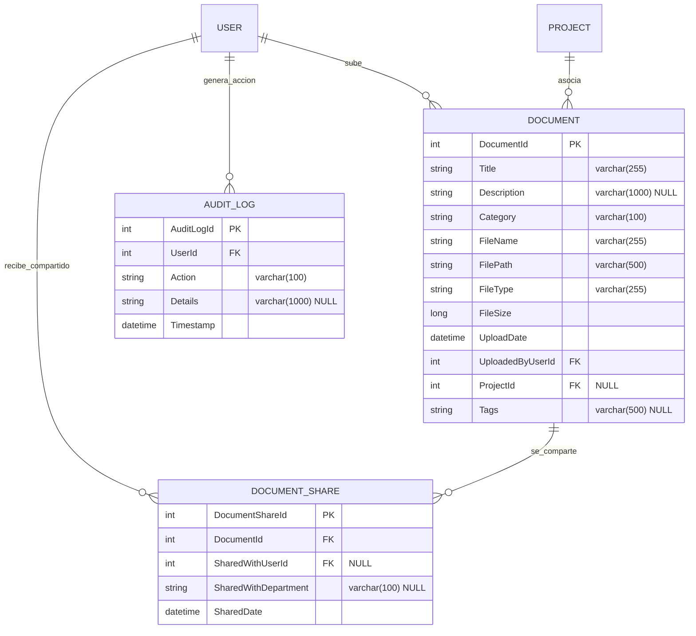

# Modelo de Datos (Phase 1): Carga y Gestión de Documentos

Este documento define el diseño de base de datos para la funcionalidad de documentos.

---

## 1. Diagrama de Relaciones (Mermaid)

---

## 2. Esquemas de Base de Datos y Entidades EF Core

### 2.1 Entidad `Document`
Mapea los metadatos esenciales de un archivo subido al sistema.
* **DocumentId**: `int` (Clave Primaria Autoincremental).
* **Title**: `string`, no nulo, máximo 255 caracteres.
* **Description**: `string`, opcional, máximo 1000 caracteres.
* **Category**: `string`, no nulo. Valores permitidos: `Project Documents`, `Team Resources`, `Personal Files`, `Reports`, `Presentations`, `Other`.
* **FileName**: `string`, nombre original del archivo proporcionado por el usuario (ej: `presupuesto_2026.xlsx`), no nulo.
* **FilePath**: `string`, ruta relativa de almacenamiento físico basada en GUID (ej: `1/personal/9f8c8d8a-bc32-4d2a-89aa-c92330a101f3.xlsx`), no nulo.
* **FileType**: `string`, tipo MIME detectado durante la subida (ej: `application/vnd.openxmlformats-officedocument.spreadsheetml.sheet`), máximo 255 caracteres, no nulo.
* **FileSize**: `long`, tamaño en bytes.
* **UploadDate**: `DateTime` (UTC).
* **UploadedByUserId**: `int` (Clave Foránea a la tabla `Users`).
* **ProjectId**: `int`, opcional (Clave Foránea a la tabla `Projects`).
* **Tags**: `string`, lista de palabras clave separadas por comas, opcional.

### 2.2 Entidad `DocumentShare`
Registra los accesos compartidos otorgados a usuarios individuales o departamentos.
* **DocumentShareId**: `int` (Clave Primaria Autoincremental).
* **DocumentId**: `int` (Clave Foránea a `Document`, cascada al borrar documento).
* **SharedWithUserId**: `int`, opcional (Clave Foránea a `Users`). Nulo si se comparte con un departamento completo.
* **SharedWithDepartment**: `string`, opcional, indica el departamento destinatario (ej. `Engineering`). Nulo si es individual.
* **SharedDate**: `DateTime` (UTC).

### 2.3 Entidad `AuditLog`
Registra los eventos de auditoría obligatorios para control de conformidad.
* **AuditLogId**: `int` (Clave Primaria Autoincremental).
* **UserId**: `int` (Clave Foránea a `Users`).
* **Action**: `string`, tipo de acción (`Upload`, `Download`, `Delete`, `Share`).
* **Details**: `string`, descripción detallada (ej: `Downloaded 'Plan_2026.pdf'`).
* **Timestamp**: `DateTime` (UTC).

---

## 3. Reglas de Validación de Datos

1. **Título Obligatorio**: No se permiten campos vacíos ni espacios en blanco.
2. **Tamaño del Archivo**: Validación estricta en código `>= 1` y `<= 26,214,400` bytes (25 MB).
3. **MIME Type**: Longitud máxima de columna de 255 caracteres para asegurar soporte a formatos largos de Office.
4. **Relaciones**:
   * Si se elimina un `Document`, se deben eliminar en cascada todas sus entradas asociadas en `DocumentShare`.
   * Si se elimina un `User`, las subidas asociadas deben restringirse o reasignarse, no eliminarse de forma predeterminada para evitar la pérdida de documentos del proyecto (`DeleteBehavior.Restrict`).
